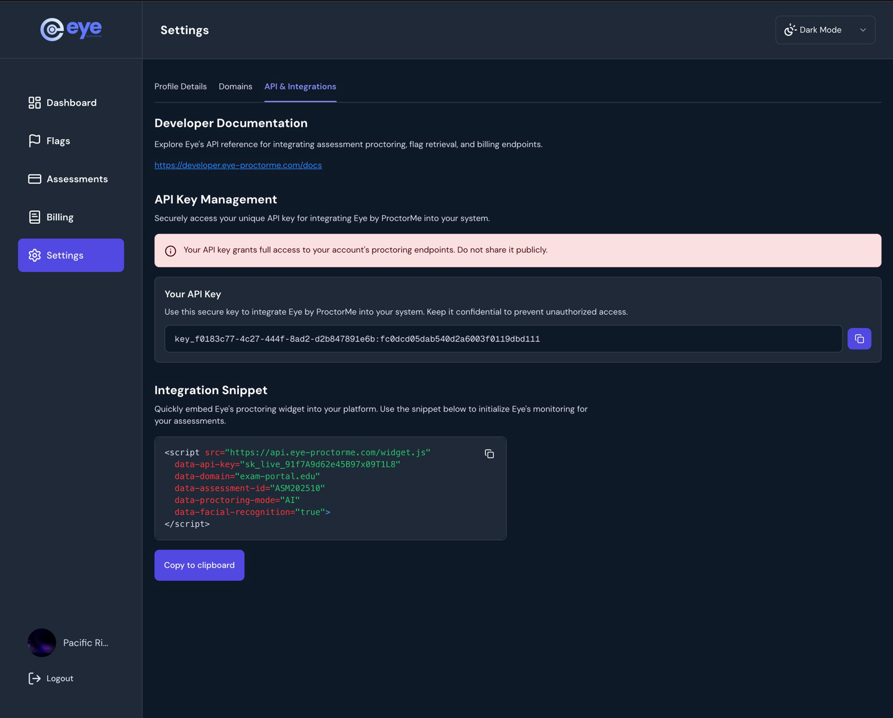
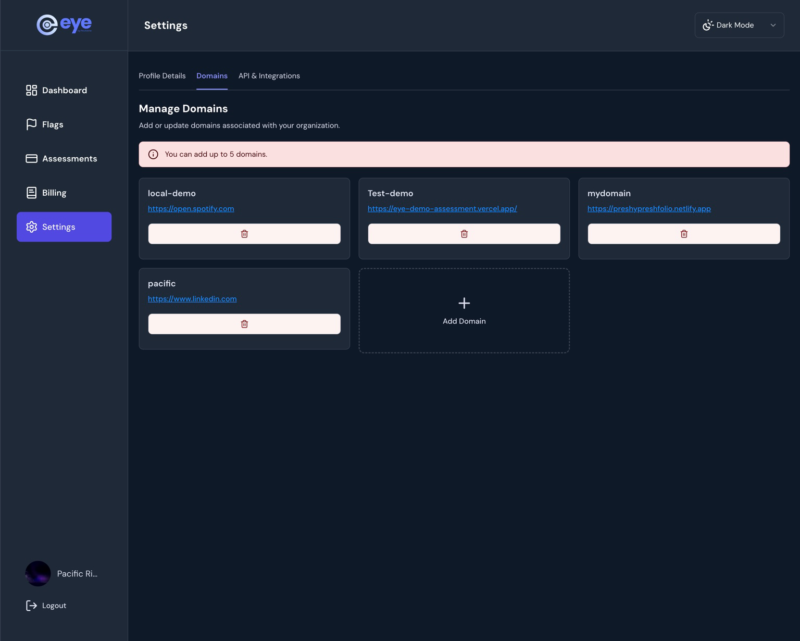

# 🔐 API Key Management

Eye provides each organisation with a **unique API key** used to integrate **Eye by Proctorme** into your assessment platform.

This page explains **where to find your API key**, **how it is used**, and **how domain restrictions protect your integration by default**.

---

## Organisation Dashboard Overview

When you register an organisation on Eye, you gain access to an **admin dashboard** where you can:

- Create and manage assessments  
- View candidates and monitoring sessions  
- Review candidate flags and violations  
- Track billing, credits, and expenses  
- Configure integrations and API access  

The dashboard gives you full visibility into your organisation’s proctoring activity.

---

## Where to Find Your API Key

Your API key is available inside the **Settings → API & Integrations** section of the dashboard.

### Steps to access your API key

1. Log in to your **Eye Admin Dashboard**
2. Click **Settings** in the left sidebar  
3. Open the **API & Integrations** tab  
4. Locate the **API Key Management** section  
5. Click the **copy icon** to copy your API key  

!!! info "Organisation-wide Key"
    The API key applies to **all assessments** created under your organisation.

---

## Dashboard Reference

Below is an example of the **API & Integrations** screen where your API key and integration snippet are displayed.



---

## What the API Key Is Used For

Your API key allows Eye to:

- Authenticate your organisation  
- Initialize the proctoring widget  
- Link candidates and assessments correctly  
- Create flags and monitoring events  
- Attribute usage to billing and credits  

If the API key is missing or invalid, **the widget will not initialize**.

---

## Domain Restriction (Built-In Protection)

Eye enforces **domain-level restriction** on every API key.

Only domains explicitly registered in your organisation’s dashboard are allowed to use your API key.

### How it works

- Each API key is **bound to approved domains**
- Requests originating from **unregistered domains are automatically rejected**
- This applies to both:
  - Widget initialization
  - API and webhook activity

!!! success "Automatic Protection"
    Even if your API key is exposed, it **cannot be used** from a domain that is not registered.

---

## Managing Allowed Domains

You can manage your organisation’s allowed domains from:

**Settings → Domains**

- Add up to **5 approved domains**
- Remove domains at any time
- Changes apply immediately



!!! info "Typical Use Cases"
    - `exam.yourdomain.com` for production  
    - `staging.yourdomain.com` for testing  
    - `localhost` for local development  

---

## Using the API Key in the Widget

You can pass your API key when initializing the widget programmatically:

```javascript
const config = {
  apiKey: "YOUR_API_KEY",
  assessmentId: "assessment123",
  candidateId: "candidate456",
  examDuration: 1800,
};
```

!!! note
    The widget will only start if the **current domain matches an approved domain**.

---

## Rotating or Revoking an API Key

If you need to rotate or revoke an API key:

1. Contact **Eye Support**
2. A new API key will be issued
3. Update your integrations with the new key

!!! info
    Domain restrictions continue to apply automatically to newly issued keys.

---


[ ← Back to Installation](./installation.md){: .md-button } | [Next: Quick Start Guide →](./quick-start.md){: .md-button .md-button--primary }

