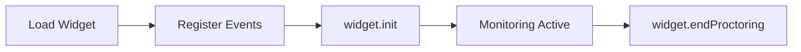

# 🧩 API Methods

Eye By Proctorme exposes a **small, event-driven JavaScript API** that allows you to initialize proctoring, listen to events, and manually end a session.

All interaction happens through the **widget instance** returned by `LoadProctormeWidget()`.

---

## Getting the Widget Instance

Before calling any API method, you must load the widget:

```ts
const widget = await LoadProctormeWidget();
```

!!! info "Async loading"
    `LoadProctormeWidget()` returns a Promise.
    Always use `await` or `.then()` before accessing widget methods.

---

## Available Methods

| Method | Description |
|--------|-------------|
| `widget.init(config)` | Initializes the proctoring session |
| `widget.on(event, callback)` | Listens for widget events |
| `widget.endProctoring()` | Ends the proctoring session manually |

---

## widget.init(config)

Initializes the proctoring session using the provided configuration object.

### Signature

```ts
widget.init(config: Config): void
```

### Example

```ts
widget.init({
  apiKey: "YOUR_API_KEY",
  assessmentId: "assessment123",
  assessmentTitle: "Frontend Development Assessment",
  candidateId: "candidate456",
  candidateEmail: "test@example.com",
  candidateFirstName: "John",
  candidateLastName: "Doe",
  institutionName: "Tech Academy International",
  examDuration: 1800,
  features: {
    aiProctoring: true,
    facialRecognition: true,
  },
});
```

!!! warning "Initialization requirements"
    - All required config fields must be provided
    - The API key must be valid
    - The current domain must be registered
    
    If initialization fails, the widget will not start proctoring.

---

## widget.on(event, callback)

Registers an event listener for a specific proctoring event.

### Signature

```ts
widget.on(event: string, callback: (payload?: any) => void): void
```

### Example

```ts
widget.on("FACE_ABSENCE", (data) => {
  console.log("Face not detected", data);
});
```

### Common Events

```javascript
widget.on("STARTED", () => {});
widget.on("END_PROCTORING", () => {});
widget.on("SOUND_DETECTED", (data) => {});
widget.on("MULTIPLE_FACE", (data) => {});
widget.on("TAB_NOT_FOCUS", (data) => {});
```

!!! info "Event-driven design"
    All monitoring signals (face, sound, tab focus) are delivered through events.
    There is no polling API.

👉 See the full list in **[Events documentation](./events.md)**

---

## widget.endProctoring()

Manually ends the proctoring session.

### Signature

```ts
widget.endProctoring(): void
```

### Example

```javascript
widget.endProctoring();
```

### Behavior

- Stops all monitoring immediately
- Triggers the `END_PROCTORING` event
- Finalizes the candidate session

!!! warning "Irreversible action"
    Once ended, a proctoring session cannot be resumed.

---

## Typical Usage Flow



---

## Common Mistakes

!!! danger "Avoid these"
    - Calling `widget.init()` before loading the widget
    - Registering event listeners after initialization
    - Ending the session unintentionally

---

[ ← Back to Configuration](./configuration.md){: .md-button } | [Next: Events →](./events.md){: .md-button .md-button--primary }


If you need help handling events or building logic on top of these methods, refer to the **[Events documentation](./events.md)**.